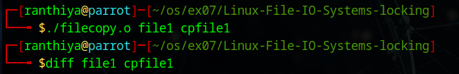
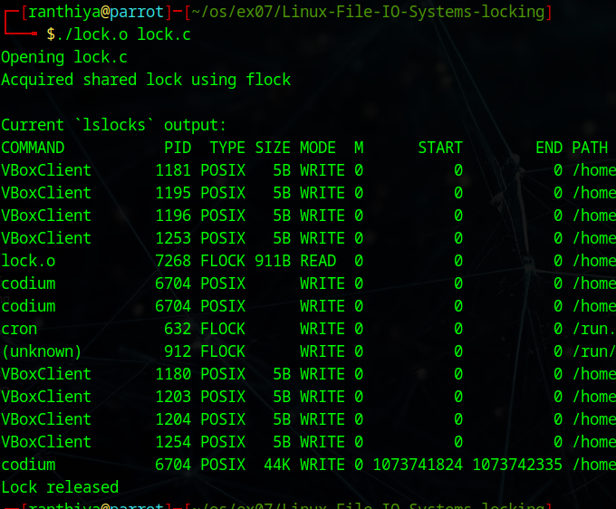

# Linux-File-IO-Systems-locking
Ex07-Linux File-IO Systems-locking
# AIM:
To Write a C program that illustrates files copying and locking

# DESIGN STEPS:

### Step 1:

Navigate to any Linux environment installed on the system or installed inside a virtual environment like virtual box/vmware or online linux JSLinux (https://bellard.org/jslinux/vm.html?url=alpine-x86.cfg&mem=192) or docker.

### Step 2:

Write the C Program using Linux IO Systems locking

### Step 3:

Execute the C Program for the desired output. 

# PROGRAM:

## 1.To Write a C program that illustrates files copying 
```#include <unistd.h>
#include <sys/stat.h>
#include <fcntl.h>
#include <stdlib.h>
#include <stdio.h>

int main(int argc, char *argv[]) {

    int in, out;
    ssize_t nread;
    char buffer[1024];

    if (argc != 3) {
        fprintf(stderr,"Usage: %s <source_file> <destination_file>\n", argv[0]);
        exit(1);
    }

    in = open(argv[1], O_RDONLY);
    if (in < 0) {
        perror("Error opening source file");
        exit(1);
    }

    out = open(argv[2], O_WRONLY | O_CREAT | O_TRUNC, 0644);
    if (out < 0) {
        perror("Error opening destination file");
        close(in);
        exit(1);
    }

    while ((nread = read(in, buffer, sizeof(buffer))) > 0) {
        write(out, buffer, nread);
    }

    close(in);
    close(out);

    return 0;
}```


## 2.To Write a C program that illustrates files locking
```#include <fcntl.h>
#include <stdio.h>
#include <stdlib.h>
#include <unistd.h>
#include <sys/file.h>

void display_lslocks() {
    printf("\nCurrent `lslocks` output:\n");
    fflush(stdout);
    system("lslocks");
}

int main(int argc, char *argv[]) {

    if (argc < 2) {
        printf("Usage: %s <filename>\n", argv[0]);
        exit(1);
    }

    char *file = argv[1];
    int fd;

    printf("Opening %s\n", file);

    fd = open(file, O_WRONLY);
    if (fd == -1) {
        perror("Error opening file");
        exit(1);
    }

    if (flock(fd, LOCK_SH) == -1) {
        perror("Error acquiring shared lock");
        close(fd);
        exit(1);
    }

    printf("Acquired shared lock using flock\n");

    display_lslocks();

    sleep(5);

    flock(fd, LOCK_UN);

    printf("Lock released\n");

    close(fd);

    return 0;
}```


## OUTPUT



# RESULT:
The programs are executed successfully.
